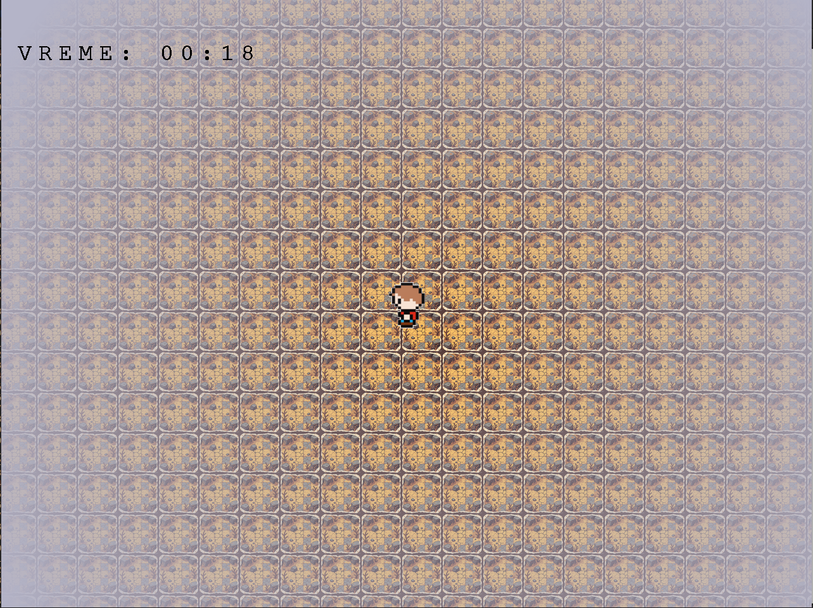
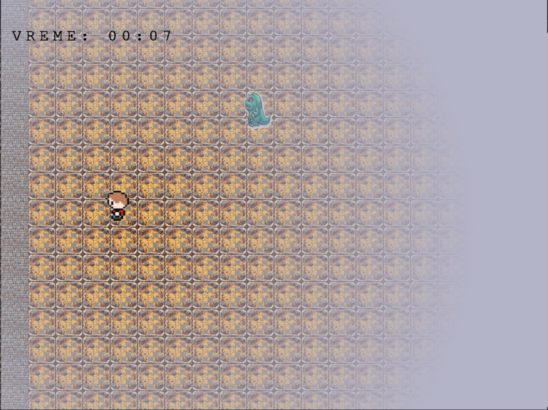
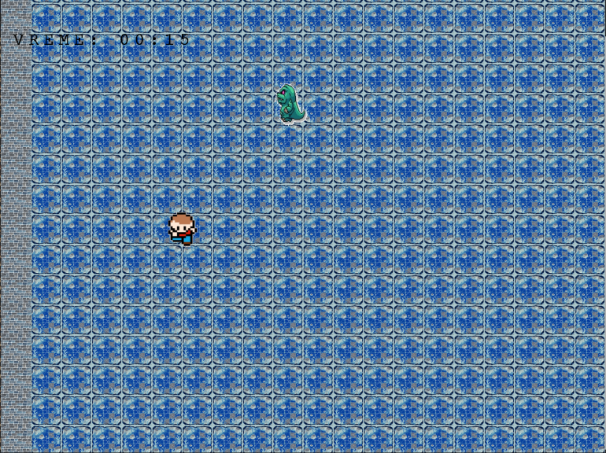
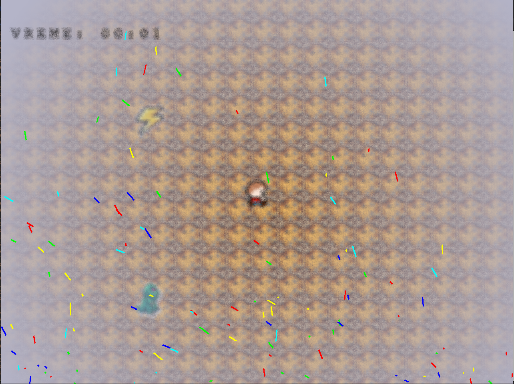
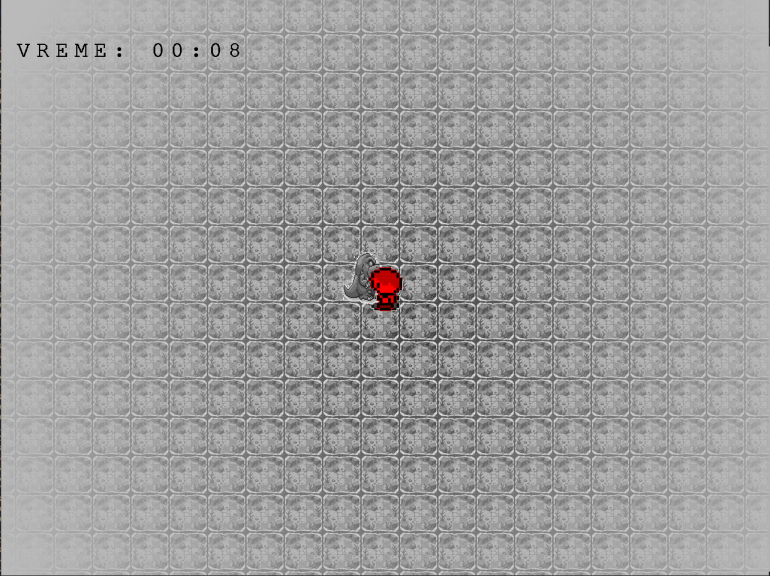

#2D Monster Survival Game

## Project Overview
A fast-paced 2D survival game where you control a hero trying to survive against waves of monsters while collecting power-ups. Built with C and RAFGL graphics library.

Gameplay Features

    Character Movement: WASD controls with smooth animation

    Monster AI: Monsters chase the hero with collision avoidance

    Power-ups: Speed boost object with visual effects

    Time Limit: Survive for 2 minutes against increasing monster waves

    Visual Effects: Fog, fisheye distortion, screen waves

    Death/Victory States: Special effects for game over conditions

Controls

    W/A/S/D: Move hero

    SPACE: Restart after death/victory

    ESC: Close game

## What does game look like:
   

## Some of the features:
 - Camera and fog following the character
   
   

   

 - Active boost
   
   

 - Victory screen
   
   

   

 - Game over screen
   
   
   
   
   
